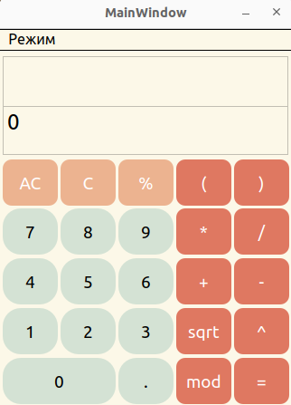
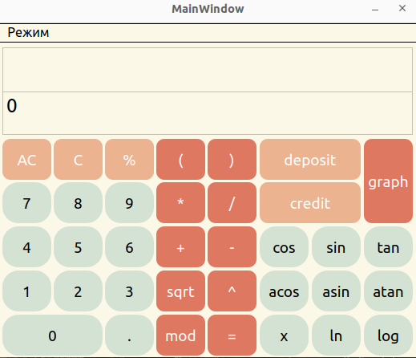
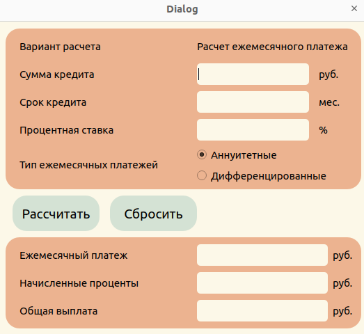
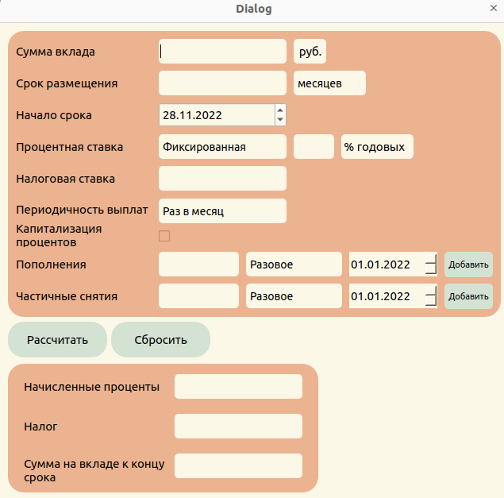

# Calculator

## Общая информация

Калькулятор написан с использованием *алгоритма Дейкстры* для перевода выражений в *обратную польскую нотацию*.
Для декомпозиции был использовани паттерн MVC (Model-View-Controller, Модель-Представление-Контроллер) представляет из себя схему разделения модулей приложения на три отдельных макрокомпонента: модель, содержащую в себе бизнес-логику, представление - форму пользовательского интерфейса для осуществления взаимодействия с программой и контроллер, осуществляющий модификацию модели по действию пользователя.

- Программа разработана на языке C++ стандарта C++17.
- Выполнено полное покрытие unit-тестами модулей, связанных с вычислением выражений, c помощью библиотеки *GTest*.
- Для реализации графического интерфейса была использована технология *Qt*.
- Для построение графиков функций была использована сторонняя библиотека *qcustomplot.h*.

## Сборка программы

- Сборка программы выполняется с помощью Makefile.
    - для установки программы в командной строке следует прописать `make` (требуется наличие установленного cmake).
    - для запуска программы перейдите в папку `build` и запустите ярлык с именем `Calculator`.
    - для удаления программы в командной строке следует прописать `uninstall`.
    - для запуска тестов в командной строке следует прописать `make test`.
    - для запуска тестов и проверки покрытия в командной строке следует прописать `make gcov_report`.

## Возможности калькулятора

- Поддержка арифметических операторов `+`, `-`, `*`, `/`.
- Выполение арифметических операций с вещественными числами.
- Построение графика функций (для построение графика следует задать функцию, прописать в ней `x` и нажать равно пример записи: "cos(x)" нажимаем `=`).
- Поддержка функций `cos(x)`, `sin(x)`, `tan(x)`, `acos(x)`, `asin(x)`, `atan(x)`, `sqrt(x)`, `ln(x)`, `log(x)`.

- Поддержка кредитного калькулятор
  - Вход: общая сумма кредита, срок, процентная ставка, тип (аннуитетный, дифференцированный).
  - Выход: ежемесячный платеж, переплата по кредиту, общая выплата.

- Поддержка депозитного калькулятора
  - Вход: сумма вклада, срок размещения, процентная ставка, налоговая ставка, периодичность выплат, капитализация процентов, список пополнений, список частичных снятий.
  - Выход: начисленные проценты, сумма налога, сумма на вкладе к концу срока.

